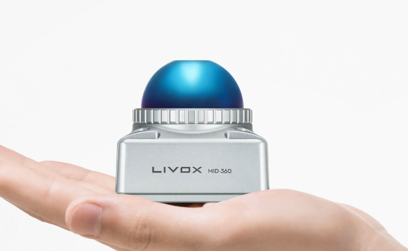

# CAVE EXPLORER — COGNIFLY

## Objectives
The purpose of this drone is to autonomously explore caves without any GPS assistance.  
It must be capable of flying **at least 15 minutes** in complete darkness.  

Its primary sensor is the **Livox MID360 LiDAR**, which provides detailed 3D point clouds.  
The drone uses **SuperOdom** to compute odometry from the LiDAR data, which is then fed into **ArduPilot** to enable powerful high-level flight control.

---

## Components

### 3D Printing & CAD

#### Battery Support
  
This support is designed to clip between the drone’s two legs.  
A zip tie passes through the middle to prevent it from sliding down onto the shocks, and Velcro straps on both sides secure the battery firmly in place.

#### Upper Frame
  
The upper frame forms part of the main structure.  
It mounts:
- The flight controller in the center on a flat platform
- The ESC and Power Module on each side

Originally designed for screw mounting, the middle platform proved too weak and brittle, so it was reinforced. The inserts are now inaccessible — double-sided tape or Velcro is sufficient to secure these components.

#### Lower Frame
  
The lower frame clamps the carbon fiber arms against the upper frame.  

**Note:**  
- If print quality is poor, some holes may need to be redrilled to fit M3 nuts (use a 3.5 mm drill).  
- Do not force screws into undersized holes — it can delaminate the print.

#### Standoff & Raspberry Pi Support
  
This part requires **M3 heat inserts** on all 8 ends — ensure they are aligned perfectly.  
The smaller central holes are for M2 inserts.  

**Tips:**  
- Drill holes ~0.5 mm larger than the inser's flat part
- Drilling into carbon fiber filament produces the most precise fit.  
- CAD modeling the exact hole size will not be as precise, but might be good enough, drilling is suggested.

#### Receiver Holder
  
Clips onto either an arm or a leg — mounting on a leg is preferred for better reception and accessibility. Receiver is too big compared to what's available on the market, but works, and is good enough for now. Eventually, the receives would need to change.

---

### Electrical / Embedded Systems
#### Sensors

**Livox Mid-360 LiDAR**  
The Mid-360 offers a 360° horizontal field of view, covering from -7° downward to +52° upward.  
[Specifications](https://www.livoxtech.com/mid-360/specs)  



---


**TFmini-S LiDAR**  
This lightweight LiDAR is used as a rangefinder for terrain tracking and altitude stabilization.  
It is connected to the flight controller via the `TELEM X` port.  
Wiring: **5V**, **GND**, **RX**, **TX**.  


---
Datasheet : https://cdn.sparkfun.com/assets/4/f/1/a/b/DS-16977-TFMini-S_-_Micro_LiDAR_Module.pdf


### Propulsion System

The propulsion system runs on **4S LiPo batteries** (nominal storage voltage: **14.8 V**).

#### Battery
- **Model:** Tattu 5200 mAh, 35C  

- **Weight:** 426 g  
- **Performance:**
  - ~18 minutes of flight time in hover
  - Voltage sag: 0.6 V under hover load
  - Mean discharge rate: 2.04 mV/s
- **Remarks:** Excellent battery for endurance. A second unit may be purchased in the future to enable quicker turnaround during testing.

#### Motors
- **Model:** [T-Motor Air Gear 350 — 2213 920KV](https://brushlessgimbal.ca/Multi-Rotor-Products-Parts/Brushless-Motor/T-Motor-Air-Gear-350-2213-920KV-Motor-Air-20A-ESC-T9545-Prop) 
 
- **Specs:**
  - KV rating: 920 KV
  - Voltage range: 3S–4S
  - Weight: 54 g per motor
- **Remarks:** Functional, but newer-generation drone motors could offer better efficiency, lower weight, and higher thrust.

**ESC**  
- Type: Generic BLHeli_S Quad 4-in-1 ESC  
- Voltage range: 2S–6S LiPo  
- [Product Link](https://www.amazon.ca/dp/B0CJVNLPZF?ref=ppx_yo2ov_dt_b_fed_asin_title)  


#### Propellers
- **Model:** [T-Motor T9545A Polymer Straight](https://store.tmotor.com/product/t9545-a-polymer-straight.html)  
- **System Metrics:**  
  

- Wiring harness  
#### Wiring & Power Distribution

**Overview**  
Power from the battery is split into two lines:
1. **Power Module** — supplies the flight controller and LiDAR  
2. **DC-DC Converter** — powers the Raspberry Pi  

**Power Module**  
- Model: ACSP4 board  
- Outputs: 12V and 5V BECs  
- 12V: Powers the LiDAR  
- 5V: Powers the flight controller  
- Battery voltage is also passed to the ESC through this module  
- Remarks: Older model, functional but could be replaced in future upgrades  
- [Documentation](https://docs.3dr.com/power-module/acsp4/#capacitor)  


**Raspberry Pi Power Supply**  
- Model: D-Planet MakerHawk 5A DC-DC  
- [Product Link](https://www.amazon.ca/dp/B079N9BFZC?ref=ppx_yo2ov_dt_b_fed_asin_title)  
- Converts battery voltage to 5V, soldered to a USB connector for Pi power  
- Modular design allows it to be bypassed in favor of a dedicated Pi power adapter if desired  


---

#### Onboard Computer Integration

**Computer**  
- Model: Raspberry Pi 5 with cooling module  
- Connections:
  - **Ethernet (end0)** to the Livox aviation connector (damaged in 2024, will require replacement)  
  - **Serial link** to flight controller via `TELEM 1`  
    - JST-GH 6-pin connector: GND, TX, RX on FC connected to GND, RX, TX on Pi  

**Telemetry Access**  
Currently, no dedicated telemetry or Wi-Fi antenna is installed, aside from the Pi’s internal Wi-Fi.  
Remote telemetry access is provided by a **MAVProxy service** running on the Pi.  
MAVProxy relays the Pi’s connection to internal UDP ports and can forward data to specific IP addresses.  
(Current configuration is set to Colin Rousseau’s laptop — you must edit the service to use other addresses for tools like Mission Planner.)

**Editing MAVProxy Configuration**  
Run on the Pi (outside of Docker):  
```bash
sudo nano /etc/systemd/system/mavproxy.service
```
After editing and saving, you can restart the service and confirm with :
```
sudo systemctl daemon-reload
sudo systemctl restart  mavproxy.service
journalctl -u mavproxy -f
```

---

## Software

## Software

### Livox_ros_driver2
- **Description:** ROS 2 driver for Livox LiDARs, responsible for retrieving raw point cloud data from the Livox MID360 and publishing it into the ROS ecosystem.  
- **Role in System:** Provides the real-time LiDAR data used by SuperOdom for odometry estimation.  
- **Links:**  
  - [GitHub Repository](https://github.com/Livox-SDK/livox_ros_driver2)  
  - [Getting Started Guide](https://deepwiki.com/Livox-SDK/livox_ros_driver2/2-getting-started)

---

### SuperOdom
- **Description:** Lidar-based odometry estimation package that processes point cloud data to estimate the drone's position and orientation over time.  
- **Role in System:** Consumes LiDAR data from `Livox_ros_driver2` and outputs odometry data to be fed into ArduPilot for GPS-denied navigation.  
- **Links:**  
  - [GitHub Repository](https://github.com/superxslam/SuperOdom)  
  - [Documentation](https://deepwiki.com/superxslam/SuperOdom)

---

### EgoSwarm
- **Description:** ROS 2 adaptation of the Ego Planner Swarm package, originally designed for multi-drone navigation and coordination.  
- **Role in System:** Provides local trajectory planning and obstacle avoidance. While designed for swarm operation, only the single-drone planning features are currently used.  
- **Links:**  
  - [GitHub Repository](https://github.com/ZJU-FAST-Lab/ego-planner-swarm/tree/ros2_version)  
  - [Documentation](https://deepwiki.com/ZJU-FAST-Lab/ego-planner-swarm)

---

### dev_ws (Development Workspace)
Custom ROS 2 workspace containing project-specific packages.

#### `odom`
- **Description:** Custom odometry processing nodes, potentially filtering, refining, or converting odometry data from SuperOdom.
- **Role in System:** Prepares odometry for integration with flight control and logging.

#### `scan_to_mavlink`
- **Description:** Converts ROS topics (such as odometry or proximity data) into MAVLink messages.
- **Role in System:** Enables sending processed navigation and sensor data from ROS 2 to ArduPilot through MAVROS.

#### Zenmav
- **Description:** High-level MAVLink control library used to interact with ArduPilot from Python.  
- **Role in System:** Handles tasks like setting flight modes, sending position updates, or triggering automated behaviors.  
- **Links:** [GitHub Repository](https://github.com/zenith-polymtl/Zenmav)

---

### ArduPilot
- **Description:** Open-source flight control firmware supporting a wide range of vehicles, including multirotors. This powerful firmare enables both low-level control, as well as High level commands and controls. Mavlink interface enables us to communicate easily with it 
- **Role in System:** Executes low-level flight stabilization, GPS-denied navigation using external odometry, terrain following, and obstacle avoidance. Receives data from ROS 2 via MAVROS.  
- **Links:**  
  - [Official Site](https://ardupilot.org/ardupilot/)  
  - [Installing MAVROS](https://ardupilot.org/dev/docs/ros-install.html#installing-mavros)  
  - [MAVROS Wiki](https://wiki.ros.org/mavros)  
  - [MAVROS Overview](https://deepwiki.com/mavlink/mavros/1-mavros-overview)

**ArduPilot Features Used:**
- **External SLAM Integration:** [Parameters for External SLAM](https://ardupilot.org/dev/docs/ros2-cartographer-slam.html) — used to fuse SuperOdom output into ArduPilot navigation.
- **Surface Tracking:** [Terrain Following](https://ardupilot.org/copter/docs/terrain-following-manual-modes.html) — for maintaining altitude over uneven terrain.
- **Obstacle Avoidance:** [Proximity and Avoidance](https://ardupilot.org/copter/docs/common-proximity-landingpage.html#common-proximity-landingpage) — to prevent collisions in confined environments.
- **Tuning:** [Tuning Guide](https://ardupilot.org/copter/docs/common-tuning.html) — system tuned manually; QuickTune was tested but provided poor results.


---

## Project Status
Mecanical designed is done, but could be refined a bit still.

 Two of the 4 motors support are still of the old design, and are working well. If they ever brake, they'll be rplace by the new motor supports, installed at the Front.
 
  Lower part of the landing gear is poorly designed and landing gear are able to twist. Annoying a bit, but non-critical. Parts are glued at the end, so changing them implied buying new carbon rods, which was overkill in Colin's opinion

  The aviation connector needs to be changed eventually.

  The downwards lidar is only clipped, and can be moved around easily. An easy solutin would to apply a dot of hot glue, a more complex solution could be added too, but is not critical. 

Software side:
    Odometry, obstacle avoidance, and sufarce tracking all work. The drone is able to use autonomous modes like GUIDED, LOITER, RTL. It can be speed controled, position controled, acceleration controled, as needed. A stable version of all those features are in the branch no_planner. 

    The current work that needs testing is the ego-swarm local planner, and eventually an even high lever planner, altough for testing, local targets can be sent manually.

    If it's integrated in theory, there was still issues with multicast causing a conflict with the ethernet port of the lidar's. Ego-Planner-Swarm needs CycloneDDS rwm implementation, which si not needed in the no_planner branch, hence this one being more stable.

    This most recent work is in the master branch, with node as :

---
## Diagrams
```mermaid
flowchart LR
    subgraph Host "Raspberry Pi 5 (host)"
        WIFI["wlan0<br/>(Wi‑Fi)"]
        ETH["end0<br/>(Ethernet to MID360)"]
        Docker["Docker Engine"]
        MAVProxy["MAVProxy<br/>(UDP router)"]
    end

    subgraph Ctn "docker_driver container"
        direction TB
        Livox["livox_ros_driver2<br/>(msg_MID360_launch.py)"]
        SuperOdom["super_odometry<br/>(livox_mid360.launch.py)"]
        DevOdom["dev_ws: py_avoid odom"]
        Scan2Mav["dev_ws: scan_to_mavlink"]
        MAVROS["MAVROS bridge"]
    end

    MID360["Livox MID360<br/>(192.168.1.3)"] --- ETH
    Docker --> Ctn

    Livox -- "/livox/points<br/>(sensor_msgs/PointCloud2)" --> SuperOdom
    SuperOdom -- "/odometry/odom<br/>(nav_msgs/Odometry)" --> DevOdom
    Livox -. optional .-> Scan2Mav

    DevOdom -- "MAVLink ODOM/ VISION" --> MAVROS
    Scan2Mav -- "MAVLink OBSTACLE_DISTANCE/PRX" --> MAVROS

    MAVROS -- "UDP 127.0.0.1:14551" --> MAVProxy
    MAVProxy -- "SERIAL TELEM" --> FCU["Pixhawk / ArduPilot"]
```


## History
The project began in **summer 2024** with **Arthur Morand**, a mechanical engineering intern.  
He designed the initial mechanical structure.  

Later, **Yann Bouthiller** performed early flight tests — reportedly without much success.  

In **summer 2025**, **Colin Rousseau** (author of this document) took over the project.  
At that time, the drone was mechanically complete but largely untested.  

A systematic test campaign of each component revealed multiple issues:
- Nearly all parts required small to major redesigns
- Both the flight controller and ESC were replaced due to faults
- A **Raspberry Pi 5** was integrated with its own onboard power supply

Updated component details can be found in the [Components](#components) section.
